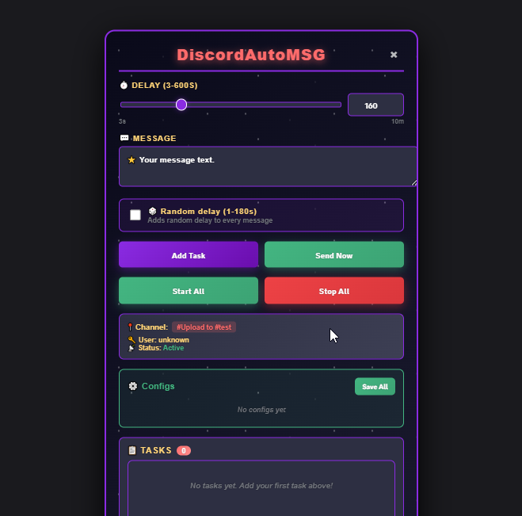

[](https://www.python.org/downloads/)
[](https://opensource.org/licenses/MIT)
[](https://github.com/islavikdev/DiscordAutoMSG/stargazers)

A powerful Discord self-bot for automated messaging with scheduling capabilities, built as a Chrome extension with Flask backend.

## DiscordAutoMSG > Menu


*Control panel interface showing active tasks*

## Features

- **Customizable Intervals**: Send messages every 3-600 seconds
- **Random Delays**: Add random delays (1-180 seconds) to messages
- **Task Management**: Create, edit, start, and stop multiple tasks
- **Configurations**: Save and load task configurations
- **User-Friendly UI**: Clean Chrome extension interface
- **Real-time Status**: Monitor task execution in real-time
- **Channel Detection**: Automatically detects current Discord channel

## Requirements

### Essential Software:
- **Python 3.11+** ([Download](https://www.python.org/downloads/))
 - While installing, click **"Add Python to `PATH`"**
  - Reboot after installation
- **PyCharm** ([Download](https://www.jetbrains.com/pycharm/download/other.html))
  - For ease of use, I recommend installing `PyCharm` Community/Professional Edition
  - You can run the project without it using console, but instructions assume PyCharm
- **Google Chrome** ([Download](https://www.google.com/chrome/))
  - The project works through Chrome extensions
- **Discord Account** (Logged in on web version)

## Quick Start Guide

### Step 1: Project Setup
1. **Download and unzip the project**
2. **Open it in PyCharm (e.g., `D:\PyProjects\DiscordAutoMSG`)**

### Step 2: Python Environment
1. **Open `Terminal` in PyCharm**
2. **Create virtual environment/active/install dependencies:**
   ```bash
   py -3.11 -m venv .venv
   .venv\Scripts\activate
   pip install flask flask-cors python-dotenv schedule requests
   pip install discord-self
3. **If interpreter isn't selected, configure it manually in `PyCharm`**

### Step 3: Get Discord Token
- **Open `discord.com/login` and sign in**
- **Press `F12` to open Developer Tools**
- **Go to `Network` tab**
- **Type `/API` in the filter/search box**
- **Press `F5` to reload page**
- **Look for requests in the network list**
- **Find the `Authorization` header (In one of the `science` folders)**
- **Copy your token (start with `MT...`)**

### Step 4: Configure Environment
- **Open `env` file in PyCharm**
- **Replace the `USER_TOKEN=` with your copied token**
- **Save with `Ctrl + S`**

### Step 5: Load Chrome Extension
- **Open Chrome and go to `chrome://extensions/` `(Alt + F)`**
- **Enable `Developer Mode` (top right toggle)**
- **Click `Load unpacked`**
- **Select the `extension` folder from your project**
- **Path example: `D:\PyProjects\DiscordAutoMSG\extension`**

### Step 6: Run the Application
- **Open `bot.py` file in `PyCharm`**
- **Click the Run button (`▶`) or press `Shift + F10`**
- **Flask server should start on http://localhost:5000**

### Step 7: Start Using
- **Refresh Discord web page**
- **Look for the robot icon `🟣` in bottom-right corner**
- **Click it to open the control panel**
- **Click `Allow` if prompted in Discord (top-left)**
- *Start creating automated tasks!*

### Task Settings:
- **Delay: 3 to 600 seconds**
- **Random Delay: Optional 1 - 180 seconds (random)***
- **Message: Any text content**
- **Channel: Auto-detected from current Discord view**

### Usage Guide:
- **Creating a `Task`**
- **Navigate to desired Discord channel**
- **Click the robot icon `🟣`**
- **Set interval (e.g., `60` seconds)**
- **Enter your `message`**
- **Enable random delay if desired**
- **Click `Add Task`**

### Managing Tasks:
- #### `Start/Stop` **Toggle individual tasks**
- #### `Start All/Stop All` **Control all tasks**
- #### `Edit` **Modify existing tasks**
- #### `Delete` **Remove tasks**

### Configurations:
- #### `Save` **Save current tasks as a named config**
- #### `Load` **Restore tasks from saved config**
- #### `Delete` **Remove saved configs**

### ⚠Important Warnings:
- `Token Security` **Never share your Discord token with others!**
- `Discord Terms`  **Using self-bots violates Discord's Terms of Service**
- `Account Risk` **Your account could be permanently banned**
- `Rate Limits` **Respect Discord's API rate limits to avoid detection**

## License/Info:
- **This project is licensed under the `MIT License`**
- **This tool is for educational purposes only**
- **The author is not responsible for any consequences resulting from the use of this software. Use at your own risk.**

# @islavikdev

- **Telegram contact:** `@islavikdev`

**If you find this project useful, please give it a star on GitHub! It helps others discover the project.**
- *Found a bug or have a feature request? Open an issue on GitHub!*